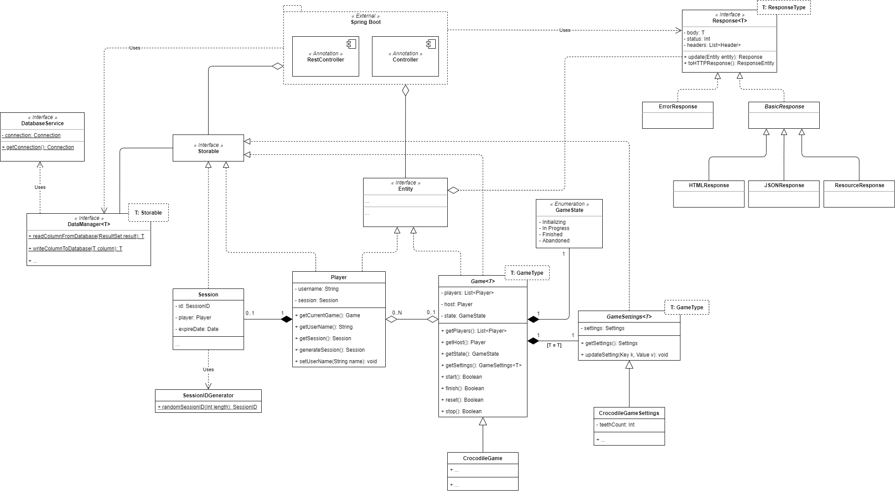

# Krokodil

A web application based on the Crocodile game,
where players pick a tooth in turn, and the person who picks the bad tooth loses.

This is a side project, intended to be played online with friends, as a result of the COVID-19 pandemic.

## Notes to self

### Game state transition graph:

### Class Diagram

