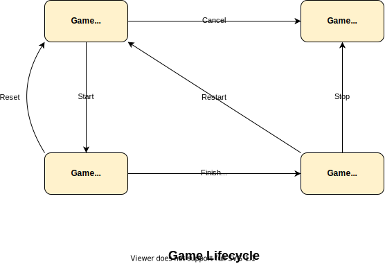

# Krokodil

 

A web application based on the Crocodile game,
where players pick a tooth in turn, and the person who picks the bad tooth loses.

This is a side project, intended to be played online with friends, as a result of the COVID-19 pandemic.

## Notes to self

### Game state transition graph:

### Class Diagram

## REST API

### `PUT /api/player/username`

- Required: `session_id`
- Required: `new_username`

### `POST /api/game/join`

- Required: `session_id`
- Required: `game_id`

### `POST /api/game/create`

- Required: `session_id`
- Returns: `game_id`